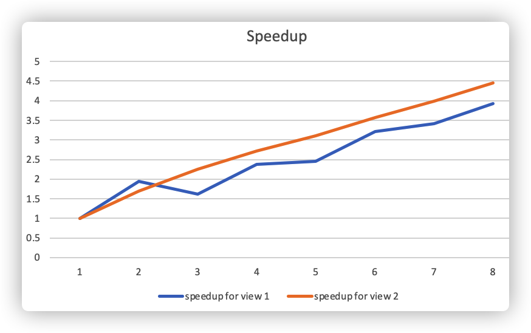
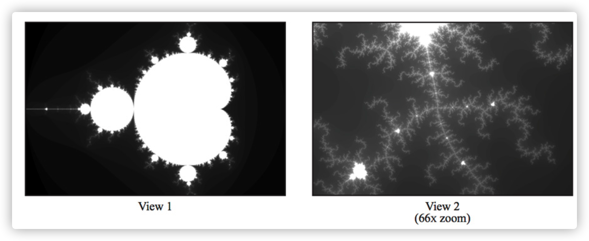
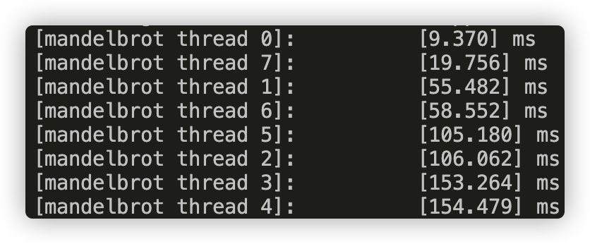
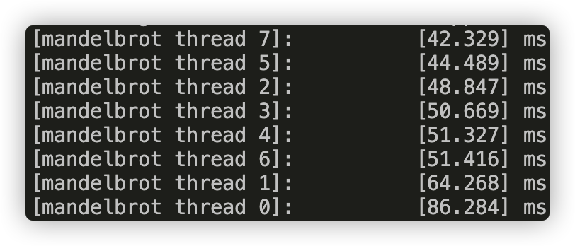
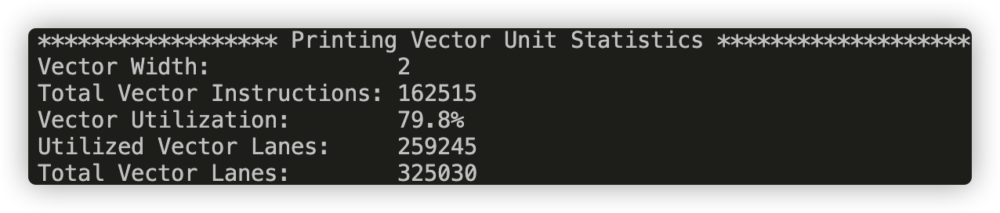
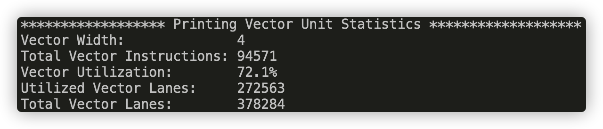
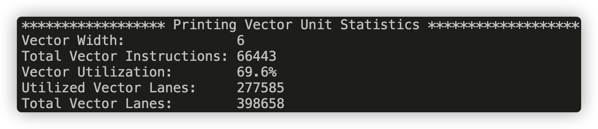
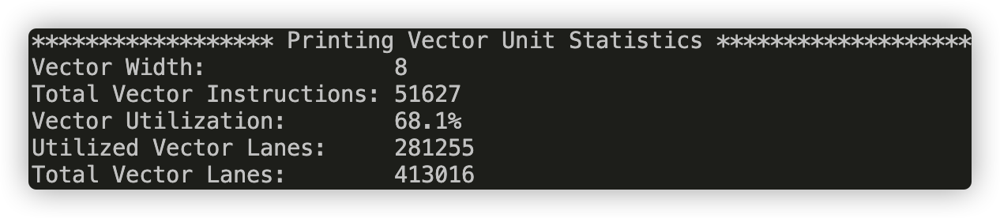

# Assignment 1: Performance Analysis on a Quad-Core CPU

The original handout is [here](Handout.md).

Below is my answers for each question.

## Program 1: Parallel Fractal Generation Using Threads (25 points)

1. Modify the starter code to parallelize the Mandelbrot generation using two processors. Specifically, compute the top half of the image in thread 0, and the bottom half of the image in thread 1. This type of problem decomposition is referred to as *spatial decomposition* since different spatial regions of the image are computed by different processors.

   Answer : see the code for more details.

2. Extend your code to use 2, 3, 4, 5, 6, 7, and 8 threads, partitioning the image generation work accordingly (threads should get blocks of the image). Note that the processor only has four cores but each core supports two hyper-threads, so it can execute a total of eight threads interleaved on its execution contents. In your write-up, produce a graph of **speedup compared to the reference sequential implementation** as a function of the number of threads used **FOR VIEW 1**. Is speedup linear in the number of threads used? In your writeup hypothesize why this is (or is not) the case? (you may also wish to produce a graph for VIEW 2 to help you come up with a good answer. Hint: take a careful look at the three-thread datapoint.)

   Answer: the graph is as follows

   

   Generally speaking, with more thread, the program runs faster. However, with k threads, the program does not run k times faster. I think the reason is the imbalanced workload between the threads. In this implementation, if the threadnum is k, the picture is split into k blocks horizontally, and the thread i is responsible for the i-th block. In the **three threads -- View 1 ** case, the middle rows (with more white parts) requires more computation, so the second thread runs much slower than the other two threads, even slower than the threads in the **two threads -- View 1** case. This explains the drop between 2 and 3 in the picture above. 

   This argument also explains the **View 2** case. From the picture below, we can see that the top rows of the **View 2** case requires more computation, which results in the imbalanced workload.

   

3. To confirm (or disprove) your hypothesis, measure the amount of time each thread requires to complete its work by inserting timing code at the beginning and end of `workerThreadStart()`. How do your measurements explain the speedup graph you previously created?

   Answer : 

   Picture 1:  runtime of each thread in view 1

   

   Picture 2:  runtime of each thread in view 2

For **View 1** we can see that the threads for the middle rows (thread 2, 3, 4, 5) runs much slower than the other threads. For **View 2**, thread 0 which is responsible for the top of the picture runs slower. These slower threads are the bottleneck for our speedup.

4. Modify the mapping of work to threads to achieve to improve speedup to at **about 7-8x on both views** of the Mandelbrot set (if you're above 7x that's fine, don't sweat it). You may not use any synchronization between threads in your solution. We are expecting you to come up with a single work decomposition policy that will work well for all thread counts---hard coding a solution specific to each configuration is not allowed! (Hint: There is a very simple static assignment that will achieve this goal, and no communication/synchronization among threads is necessary.). In your writeup, describe your approach to parallelization and report the final 8-thread speedup obtained.

   Answer : the solution is quite straighforward, if the threadnum is n, the thread i is responsible for the k * n + i rows of the picture.

   with this modification, I achived 7.25x speedup for **View 1** and 6.75x speedup for **View 2**.

5. Now run your improved code with 16 threads. Is performance noticably greater than when running with eight threads? Why or why not?

   The performance is not noticably greater than when running with eight threads, because the CPU only has 4 cores and 2 hyper-thread per core, which supplies 8-thread multi-threading feature.

## Program 2: Vectorizing Code Using SIMD Intrinsics (25 points)

1. Implement a vectorized version of `clampedExpSerial` in `clampedExpVector` . Your implementation should work with any combination of input array size (`N`) and vector width (`VECTOR_WIDTH`).

   Answer : see the code for details.

2. Run `./myexp -s 10000` and sweep the vector width from 2, 4, 8, to 16. Record the resulting vector utilization. You can do this by changing the `#define VECTOR_WIDTH` value in `CS149intrin.h`. Does the vector utilization increase, decrease or stay the same as `VECTOR_WIDTH` changes? Why?

   Answer :

   VECTOR_WIDTH = 2

   

   VECTOR_WIDTH = 4

   

   VECTOR_WIDTH = 6

   

   VECTOR_WIDTH = 8

   

   From the pictures above, we can see that as the vector_width increases, the Vector Utilization decreases, because with a bigger vector_width, a vector operation has higher possibility to have a mask with many disabled lanes.

3. *Extra credit: (1 point)* Implement a vectorized version of `arraySumSerial` in `arraySumVector`. Your implementation may assume that `VECTOR_WIDTH` is a factor of the input array size `N`. Whereas the serial implementation has `O(N)` span, your implementation should have at most `O(N / VECTOR_WIDTH + log2(VECTOR_WIDTH))` span. You may find the `hadd` and `interleave` operations useful.

   Answer : see the code for details.

## Program 3: Parallel Fractal Generation Using ISPC (20 points)

### Part 1. A Few ISPC Basics

1. Compile and run the program mandelbrot ispc. **The ISPC compiler is currently configured to emit 8-wide AVX2 vector instructions.** What is the maximum speedup you expect given what you know about these CPUs? Why might the number you observe be less than this ideal? (Hint: Consider the characteristics of the computation you are performing? Describe the parts of the image that present challenges for SIMD execution? Comparing the performance of rendering the different views of the Mandelbrot set may help confirm your hypothesis.)

Answer : Ideally, this programme may achieve 8x speedup since ISPC emits 8-wide AVX2 vector instructions, but I only achieve 4.44x speedup for view1, and 4.14x speedup for view2. This is caused by the unbalanced computation in the lanes of the same AVX2 instruction, i.e. the black white transition parts in the picture. Compared the two views, you may find more 'white branches' in the view 2, which leads to worse performance.

### Part 2.  ISPC Tasks

1. Run `mandelbrot_ispc` with the parameter `--tasks`. What speedup do you observe on view 1? What is the speedup over the version of `mandelbrot_ispc` that does not partition that computation into tasks?

   Answer: I achieve 6.96x speedup from task ISPC and 4.44x speedup from trivial ISPC.

2. There is a simple way to improve the performance of `mandelbrot_ispc --tasks` by changing the number of tasks the code creates. By only changing code in the function `mandelbrot_ispc_withtasks()`, you should be able to achieve performance that exceeds the sequential version of the code by over 40 times! How did you determine how many tasks to create? Why does the number you chose work best?

   Answer : I determin the number of tasks according to the maximum hyper-threads the machine can provide. I achieved the best performance with 8 work.

## Program 4: Iterative `sqrt`

1. Build and run `sqrt`. Report the ISPC implementation speedup for single CPU core (no tasks) and when using all cores (with tasks). What is the speedup due to SIMD parallelization? What is the speedup due to multi-core parallelization?

   Answer : I achieved 3.77x speedup from trivial ISPC and 98.67x speedup from 64 task ISPC. i.e. 3.77x speedup due to SIMD parallelization and 26.17x speedup due to multi-core parallelization.

2. Modify the contents of the array values to improve the relative speedup of the ISPC implementations. Construct a specifc input that **maximizes speedup over the sequential version of the code** and report the resulting speedup achieved (for both the with- and without-tasks ISPC implementations). Does your modification improve SIMD speedup? Does it improve multi-core speedup (i.e., the benefit of moving from ISPC without-tasks to ISPC with tasks)? Please explain why.

   Answer : I construct an array with all the elements equal 2.998. Since all the elements are equal, each lane requires the same iteration, leads to no-mask in the SIMD parallelization. Also, 2.998 requires much more computation which will saturate the CPU and compensate for the multi-threading overhead in the task version. I achieved 5.58x speedup from ISPC and 144.70x speedup from task ISPC.

3. Construct a specific input for `sqrt` that **minimizes speedup for ISPC (without-tasks) over the sequential version of the code**. Describe this input, describe why you chose it, and report the resulting relative performance of the ISPC implementations. What is the reason for the loss in efficiency? **(keep in mind we are using the `--target=avx2` option for ISPC, which generates 8-wide SIMD instructions)**.

   Answer : I construct an array with all the elements equal 1 except for those whose index is multiples of 8 which equal 2.998. For this input, I achieve 0.78x speedup from ISPC, which is worse than the serial case.

## Program 5: BLAS `saxpy`

1. Compile and run `saxpy`. The program will report the performance of ISPC (without tasks) and ISPC (with tasks) implementations of saxpy. What speedup from using ISPC with tasks do you observe? Explain the performance of this program. Do you think it can be substantially improved? (For example, could you rewrite the code to achieve near linear speedup? Yes or No? Please justify your answer.)

   Answer : I only achive 1.44x speedup from use of tasks. Since this program requires many memory accesses, so it is limited by the bandwidth of memory. I think it can not be substantially improved.

2. **Extra Credit:** (1 point) Note that the total memory bandwidth consumed computation in `main.cpp` is `TOTAL_BYTES = 4 * N * sizeof(float);`. Even though `saxpy` loads one element from X, one element from Y, and writes one element to `result` the multiplier by 4 is correct. Why is this the case? (Hint, think about how CPU caches work.)

   Answer : the write-back strategy makes the write action require two data transfer. One for write the value into memory, another for load the value into cache. 

